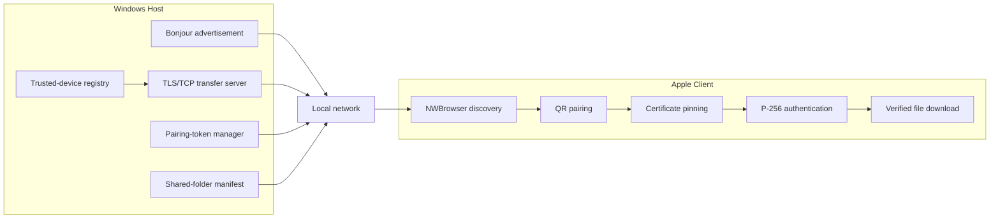

# P2P File Transfer Reference

A cross-platform local-network file transfer reference implementation that separates protocol, trust, runtime hosting, and UI shell concerns across Apple and Windows. This repository is portfolio-safe: it contains no proprietary source code, business logic, or business data.

[Apache 2.0 License](./LICENSE) | [Architecture](./docs/architecture.md) | [Protocol](./docs/protocol.md) | [Security](./docs/security.md) | [CI Workflow](./.github/workflows/ci.yml)

## Repository Layout

- [`P2PFileSharingSDK`](./Apple/P2PFileDemo/P2PFileSharingDemoSDK/README.md): reusable Swift package for discovery, pairing payloads, trusted-device storage, manifest comparison, transfer state, SDK-owned SwiftUI flows, and deterministic mocks.
- [`Apple/P2PFileDemo`](./Apple/P2PFileDemo/README.md): Apple sample app that embeds the SDK and exercises pairing, browsing, and downloads.
- [`Windows/`](./Windows/README.md): Windows reference runtime, tray shell, service shell, shared protocol/infrastructure libraries, and .NET tests.
- [`docs/`](./docs/architecture.md): architecture, protocol, security, pairing, transfer, and troubleshooting documentation.

## System Diagram



## Verification Status

Verification status as of **August 5, 2026**:

| Component | Status | Notes |
| --- | --- | --- |
| Swift SDK build | Verified | `swift build` / `swift test` in `Apple/P2PFileDemo/P2PFileSharingDemoSDK` |
| iOS simulator build | Verified | Unsigned `xcodebuild` for `P2PFileDemo` |
| Swift package tests | Verified | Covers pairing payloads, manifest comparison, path normalization, fingerprint normalization, trusted-device coding, frame decoding, malformed frame rejection, reconciliation, and partial-file cleanup |
| .NET cross-target compile | Verified | Native Windows restore, Release build, and shared-library tests run through GitHub Actions. |
| .NET shared-library tests | Verified | `Windows/P2PFile.Tests` |
| Windows tray native run | Verified | Native tray startup, Bonjour advertisement, runtime hosting, settings, and QR pairing verified. |
| Windows service installation | Verified | Service installation, startup, shutdown, and background-host lifecycle verified on Windows. |
| Real iPad-to-Windows transfer | Verified | Physical-device discovery, QR pairing, trust persistence, manifest browsing, download, hash verification, and saved-file reconciliation verified. |

## What The Demo Shows

1. A Windows tray-hosted runtime advertises `_p2pfiles._tcp`, rotates a short-lived pairing token, and renders a QR payload.
2. The Apple client discovers the host with `NWBrowser`, scans the QR payload, pins the advertised certificate fingerprint, and authenticates with a local P-256 identity.
3. The client requests a relative-path manifest, compares it to saved transfer records, and downloads selected files with SHA-256 verification and atomic file commits.
4. Trust, runtime hosting, protocol framing, persistence, and UI concerns stay separated so the SDK/runtime layers can be reused independently from the sample shells.

## Apple Setup

1. Open [`Apple/P2PFileDemo/P2PFileDemo.xcodeproj`](./Apple/P2PFileDemo/P2PFileDemo.xcodeproj).
2. The Xcode project already references [`Apple/P2PFileDemo/P2PFileSharingDemoSDK`](./Apple/P2PFileDemo/P2PFileSharingDemoSDK/Package.swift) locally and uses its `P2PFileSharingSDK` product.
3. Review the Apple-specific notes in [`Apple/P2PFileDemo/README.md`](./Apple/P2PFileDemo/README.md).
4. Build for an iPad simulator or a real iPad running iPadOS 17 or later.

## Windows Setup

1. Open [`Windows/P2PFile.sln`](./Windows/P2PFile.sln) in VS.
2. Configure the share root. The reference runtime defaults to `Documents\P2PFileShare`.
3. Launch `P2PFile.Tray` to expose runtime status, trusted-device management, and the pairing QR payload.
4. Optionally install or publish `P2PFile.Service` if you want a dedicated background host instead of the tray-owned runtime.

## Build And Test

Apple package:

```bash
cd Apple/P2PFileDemo/P2PFileSharingDemoSDK
swift test
```

Windows solution:

```bash
dotnet build Windows/P2PFile.sln
dotnet test Windows/P2PFile.Tests/P2PFile.Tests.csproj
```

GitHub Actions is wired in [`./.github/workflows/ci.yml`](./.github/workflows/ci.yml) for:

- Swift package tests on macOS
- Unsigned iOS demo build on macOS
- .NET restore, build, and test on Windows

## Firewall And Discovery Notes

- Allow inbound TCP on the configured runtime port. The reference profile uses `48888`.
- Apple discovery uses `NWBrowser` and the `_p2pfiles._tcp` service type directly.
- TXT metadata is intentionally limited to protocol version, display name, device identifier, capabilities, and pairing-required state.
- Tokens, file names, paths, and permanent secrets do **not** belong in Bonjour TXT records.

## More Docs

- [Architecture](./docs/architecture.md)
- [Protocol](./docs/protocol.md)
- [Security](./docs/security.md)
- [Pairing Sequence](./docs/pairing-sequence.md)
- [Transfer Sequence](./docs/transfer-sequence.md)
- [Troubleshooting](./docs/troubleshooting.md)

## License

This repository is licensed under the [Apache License 2.0](./LICENSE).
