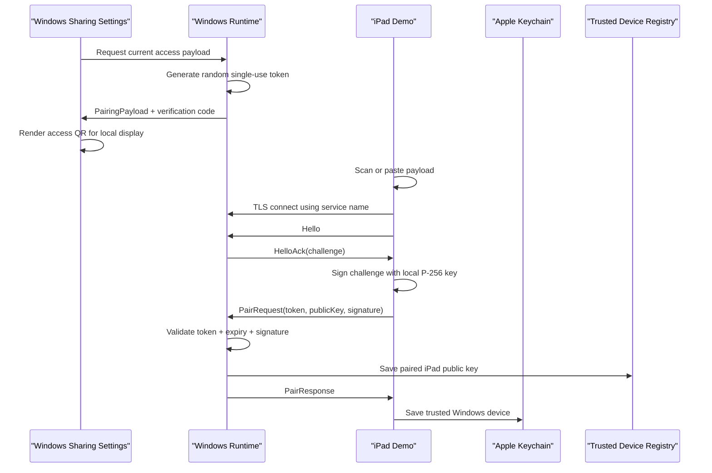

# Pairing Sequence

```mermaid
sequenceDiagram
    participant Tray as "Windows Sharing Settings"
    participant Runtime as "Windows Runtime"
    participant iPad as "iPad Demo"
    participant Keychain as "Apple Keychain"
    participant Registry as "Trusted Device Registry"

    Tray->>Runtime: Request current access payload
    Runtime->>Runtime: Generate random single-use token
    Runtime->>Tray: PairingPayload + verification code
    Tray->>Tray: Render access QR for local display
    iPad->>iPad: Scan or paste payload
    iPad->>Runtime: TLS connect using service name
    iPad->>Runtime: Hello
    Runtime->>iPad: HelloAck(challenge)
    iPad->>iPad: Sign challenge with local P-256 key
    iPad->>Runtime: PairRequest(token, publicKey, signature)
    Runtime->>Runtime: Validate token + expiry + signature
    Runtime->>Registry: Save paired iPad public key
    Runtime->>iPad: PairResponse
    iPad->>Keychain: Save trusted Windows device
```
