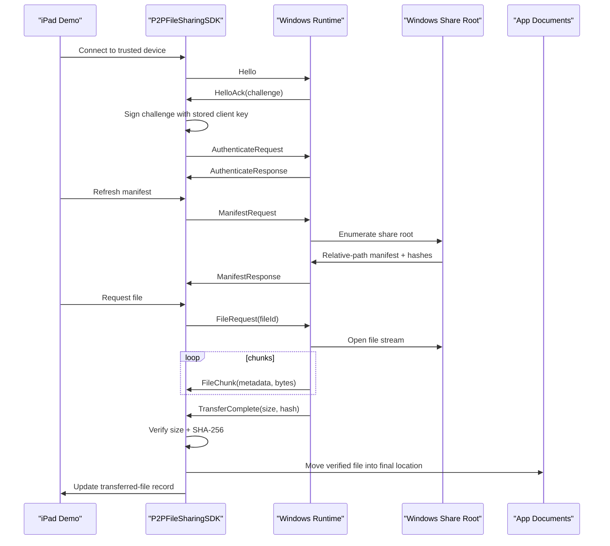

# Transfer Sequence

```mermaid
sequenceDiagram
    participant iPad as "iPad Demo"
    participant SDK as "P2PFileSharingSDK"
    participant Runtime as "Windows Runtime"
    participant Share as "Windows Share Root"
    participant Storage as "App Documents"

    iPad->>SDK: Connect to trusted device
    SDK->>Runtime: Hello
    Runtime->>SDK: HelloAck(challenge)
    SDK->>SDK: Sign challenge with stored client key
    SDK->>Runtime: AuthenticateRequest
    Runtime->>SDK: AuthenticateResponse
    iPad->>SDK: Refresh manifest
    SDK->>Runtime: ManifestRequest
    Runtime->>Share: Enumerate share root
    Share->>Runtime: Relative-path manifest + hashes
    Runtime->>SDK: ManifestResponse
    iPad->>SDK: Request file
    SDK->>Runtime: FileRequest(fileId)
    Runtime->>Share: Open file stream
    loop chunks
        Runtime->>SDK: FileChunk(metadata, bytes)
    end
    Runtime->>SDK: TransferComplete(size, hash)
    SDK->>SDK: Verify size + SHA-256
    SDK->>Storage: Move verified file into final location
    SDK->>iPad: Update transferred-file record
```
